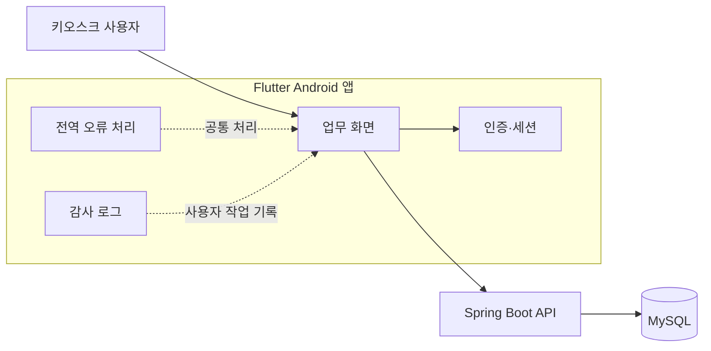

import CaseSection from "../../components/content/CaseSection.astro";

> 의료·공공 시스템의 실제 사용자 데이터와 내부 API는 포함하지 않았으며, 공개 가능한 범위에서 담당한 애플리케이션 기능을 정리했습니다.

## 경력 정보와 담당 범위

지투이 개발팀에서 Flutter 기반 Android 키오스크 앱과 키오스크에서 사용하는 Spring Boot CRUD API를 개발했습니다. 정확한 프로젝트 인원은 확인되지 않아 팀 전체의 설계나 성과로 표현하지 않습니다.

<CaseSection
  id="emergency-kiosk"
  title="Case 1. 통합응급의료정보망 키오스크"
  summary="키오스크 화면과 백엔드 API를 함께 개발하고, 인증·세션·오류·감사 로그를 화면별 구현에서 공통 기능으로 분리했습니다."
  featured={true}
>

### 앱과 API를 함께 개발한 범위

Flutter 기반 Android 키오스크 앱과 키오스크에서 사용하는 Spring Boot CRUD API를 함께 개발했습니다. 화면별로 인증 상태와 오류 처리 코드를 반복하지 않도록 인증·세션·전역 오류와 감사 로그를 공통 기능으로 구성했습니다.

이 다이어그램은 담당한 앱과 API의 책임 경계만 나타냅니다. 실제 서버 구성, 네트워크 토폴로지, 의료 데이터 흐름이나 별도 인증 서버는 확인된 범위가 아니므로 포함하지 않았습니다.

### 공통 기능

- 인증: 인증된 사용자 상태를 확인했습니다.
- 세션: 세션 상태와 만료 처리를 공통 기능으로 구성했습니다.
- 전역 오류: 화면마다 반복하지 않도록 공통 오류 처리 경로를 두었습니다.
- 감사 로그: 사용자의 주요 작업을 기록하는 기능을 구현했습니다.

구체적인 인증 방식, 로그 스키마, 암호화 저장이나 중앙 로그 수집은 확인된 범위가 아니므로 설명하지 않습니다.

### CRUD API와 구조적 결과

키오스크 기능에서 사용하는 CRUD API를 Spring Boot로 구현했습니다. 앱 화면과 API를 함께 개발하면서 화면 기능, 인증 상태, 오류 처리와 사용자 작업 기록을 분리해 표현할 수 있게 했습니다.

운영 장애율, 처리 시간, 개인정보 보호 효과는 측정 또는 확인된 근거가 없어 결과로 포함하지 않습니다.

</CaseSection>

<CaseSection
  id="life-sustaining-treatment-portal"
  title="Case 2. 연명의료정보포탈 접근 권한"
  summary="인증된 사용자의 역할에 따라 메뉴별 접근 가능 범위를 구분하는 세부 권한 처리 로직을 구현했습니다."
>

### 메뉴별 세부 접근 권한

연명의료정보포탈에서는 사용자 역할에 따라 메뉴별 접근 가능 범위를 다르게 적용하는 권한 처리 로직을 구현했습니다. 전체 인증 정책이나 개인정보 암호화가 아니라, 인증된 사용자의 메뉴 접근 범위를 세분화하는 작업을 담당했습니다.

| 처리 흐름 | 구현 범위 |
| --- | --- |
| 사용자 역할 확인 | 인증된 사용자의 역할을 기준으로 접근 범위를 확인 |
| 메뉴별 권한 확인 | 메뉴별 접근 가능 여부를 구분 |
| 접근 허용 또는 제한 | 권한에 따라 메뉴 접근 범위를 적용 |

실제 메뉴명, 내부 권한 코드와 전체 인가 정책은 공개하지 않습니다.

</CaseSection>

## 근거

- 사용자가 확인한 지투이 재직 기간과 개발 범위
- Flutter 키오스크 앱, Spring Boot CRUD API와 공통 기능 구현 사실
- 메뉴별 세부 접근 권한 처리 로직 구현 사실
