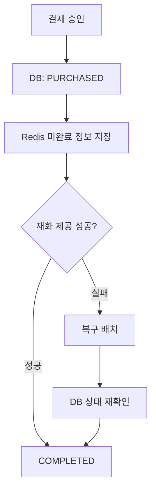

import RoleBoundary from "../../components/content/RoleBoundary.astro";
import StateFlow from "../../components/content/StateFlow.astro";
import FailureBoundary from "../../components/content/FailureBoundary.astro";
import CaseSection from "../../components/content/CaseSection.astro";

> 내부 코드와 결제 데이터는 포함하지 않았으며, 공개 가능한 범위에서 당시 처리 구조와 책임 경계를 재구성했습니다.

## 경력 정보와 역할 경계

통합 결제 시스템에 직접 관여한 인원은 백엔드 개발자 1명과 DBA 1명이었습니다. 애플리케이션 흐름과 DB 처리 구조의 책임을 다음과 같이 구분합니다.

<RoleBoundary
  mine={[
    "PG 결제 API와 Google Play·Apple 인앱 결제 구현",
    "REQUESTED·PURCHASED·COMPLETED 상태 흐름 구현",
    "Redis TTL 기반 미완료 주문 복구 배치 구현",
    "ShedLock을 이용한 복구 스케줄러 중복 실행 방지",
  ]}
  team={[
    "DBA와 Stored Procedure 기반 결제 처리 흐름 협업",
  ]}
  external={[
    "Stored Procedure와 DB 처리 구조는 DBA가 설계",
    "PG사의 중복 승인 방어 동작",
    "Google Play·Apple 영수증 검증 API",
  ]}
/>

<CaseSection
  id="integrated-payment"
  title="Case 1. 땅콩스쿨 통합 결제 API"
  summary="외부 승인과 내부 재화 제공을 상태로 분리하고, 완료되지 않은 PURCHASED 주문의 재처리 범위를 정의했습니다."
  featured={true}
>

### 문제

PG 승인과 앱스토어 영수증 검증은 외부 시스템에서 이루어지고, 승인 이후 내부 재화 제공과 완료 상태 저장이 이어집니다. 외부 승인은 성공했지만 내부 반영이 끝나지 않는 경우를 식별하고 다시 처리할 구조가 필요했습니다.

### 상태 전이

<StateFlow
  title="땅콩스쿨 결제 상태 전이"
  description="주문 생성 후 외부 승인이 DB에 반영되면 PURCHASED가 되고, 재화 제공이 완료되면 COMPLETED로 전이합니다."
  states={[
    { id: "requested", label: "REQUESTED", description: "주문과 주문키 생성" },
    { id: "purchased", label: "PURCHASED", description: "외부 승인 DB 반영" },
    { id: "completed", label: "COMPLETED", description: "재화 제공 완료" },
  ]}
  transitions={[
    { from: "requested", to: "purchased", label: "PG·앱스토어 승인" },
    { from: "purchased", to: "completed", label: "재화 제공" },
  ]}
/>

처리 흐름은 주문 요청, PG 준비, 구매 처리, 완료 처리로 나눴습니다. `requestOrder`에서 주문과 주문키를 만들고, 외부 PG의 ready 호출 정보를 Redis에 보관했습니다. `purchase`에서 승인 결과를 DB의 `PURCHASED`로 반영한 뒤 재화를 제공하고 `COMPLETED`로 변경했습니다.

### 결제 수단별 구현

- PG 결제 API의 준비·구매·완료 흐름을 구현했습니다.
- Google Play 영수증 검증, 구독 연장과 구매 확인 처리를 구현했습니다.
- Apple 인앱 결제 영수증 검증을 구현했습니다.

Google Play와 Apple의 구현 범위가 같았다고 일반화하지 않으며, 영수증 검증이 모든 위변조나 사기 결제를 차단한다고 표현하지 않습니다.

### 중복 처리 방어

PG 승인 반영 전에는 DB 주문 상태를 확인했습니다. 인앱 결제는 Redis에서 영수증을 먼저 확인하고 단일 JVM 안에서 `synchronized(this)`를 사용했지만, 여러 WAS에서는 같은 영수증 검증이 동시에 진행될 수 있었습니다.

최종 방어선으로 DB의 결제 트랜잭션 식별키에 UNIQUE 제약을 적용했습니다. 애플리케이션 사전 검증과 DB 제약을 서로 다른 방어선으로 사용한 것이며, 모든 중복 요청이나 분산 동시성을 완전히 제어한다는 의미는 아닙니다.

### 미완료 주문 복구 배치

Redis의 `PURCHASED` 정보를 약 300초 TTL로 관리하고, TTL이 약 130초 이하로 남은 주문을 복구 대상으로 조회했습니다. DB 상태를 다시 확인한 뒤 재화 제공과 `COMPLETED` 처리를 다시 수행했습니다.

> PG 승인 후 DB의 `PURCHASED` 저장이 실패한 경우는 이 흐름으로 복구할 수 없습니다.

ShedLock은 여러 WAS에서 복구 스케줄러가 동시에 실행되는 것을 제한했습니다. 주문 처리 전체의 멱등성을 보장하는 장치로 확대하지 않습니다.

### 복구 책임 범위

<FailureBoundary
  recoverable={[
    "DB에 PURCHASED 상태가 저장된 뒤 재화 제공 또는 COMPLETE 처리가 실패한 주문",
    "Redis의 미완료 정보가 TTL 안에 남아 있고 복구 배치가 조회할 수 있는 주문",
  ]}
  notRecoverable={[
    "PG 승인은 성공했지만 DB의 PURCHASED 저장 자체가 실패한 경우",
    "Redis 캐시가 유실된 경우",
    "서비스 중단이 TTL보다 길어 Redis 정보가 만료된 경우",
    "외부 결제 상태와 내부 DB의 정기 reconciliation이 필요한 경우",
  ]}
/>

복구 범위를 다시 검토하면서 반복문 안의 특정 조건이 `continue`가 아니라 `return`을 사용해 이후 주문 처리를 중단할 수 있음을 확인했습니다. 당시 수정 여부는 확인되지 않아 수정 성과로 기록하지 않습니다.

### 구조적 결과와 한계

- 외부 승인과 내부 재화 제공을 상태로 구분했습니다.
- 완료되지 않은 `PURCHASED` 주문을 복구 대상으로 식별할 수 있게 했습니다.
- 애플리케이션 검증과 DB UNIQUE 제약을 서로 다른 중복 방어선으로 사용했습니다.
- ShedLock으로 여러 WAS의 복구 스케줄러 동시 실행을 제한했습니다.

운영 장애율이나 복구율은 공개 가능한 측정 근거가 없어 결과에 포함하지 않습니다.

</CaseSection>

<CaseSection
  id="legacy-payment-refactoring"
  title="Case 2. 호두잉글리쉬 결제 리팩터링"
  summary="PG사별로 결합돼 있던 결제 로직을 공통 인터페이스와 개별 구현체로 분리했습니다."
>

### 기존 구조와 변경 범위

기존 결제 코드는 PG사별 동작이 결제 흐름에 결합돼 있었습니다. 공통 결제 인터페이스를 정의하고 PG별 로직을 개별 구현체로 분리했으며, 사내 어드민 시스템의 결제 관련 레거시 기능을 유지보수했습니다.

이 작업은 땅콩스쿨 신규 통합 결제 API와 별도 사례입니다. 전체 결제 시스템의 완전한 재설계나 대규모 구조 전환으로 표현하지 않습니다.

</CaseSection>

## 근거

- 사용자가 확인한 역할과 공개 범위
- 당시 결제 상태와 Stored Procedure 연동 구조
- Google Play·Apple 처리 범위
- Redis TTL, DB UNIQUE 제약과 ShedLock 적용 범위
