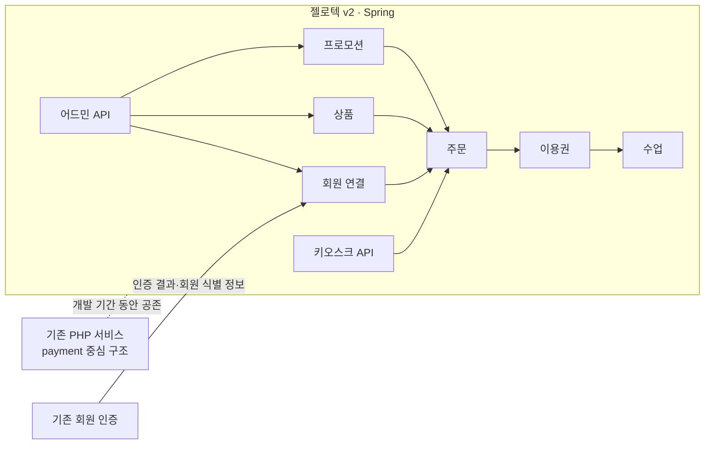
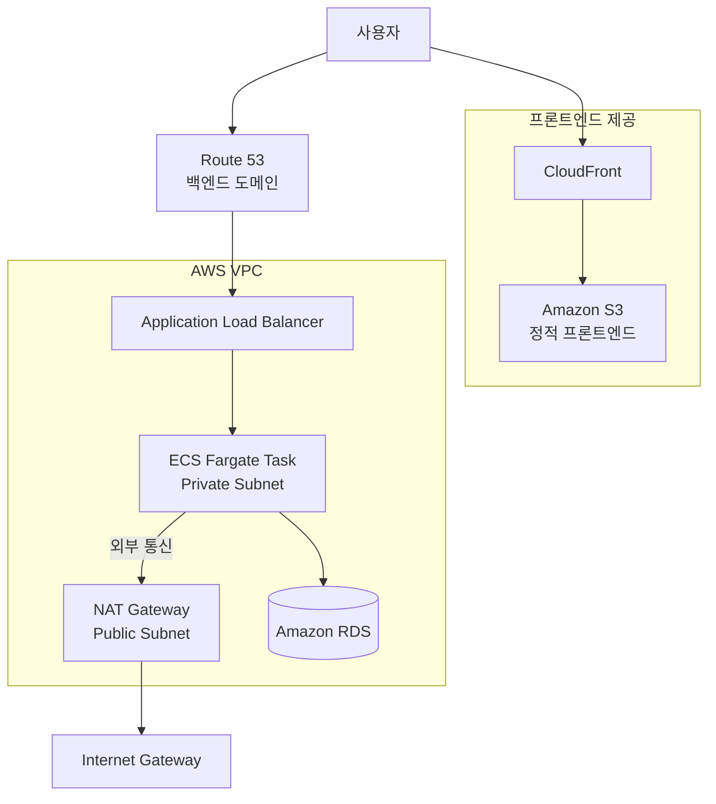
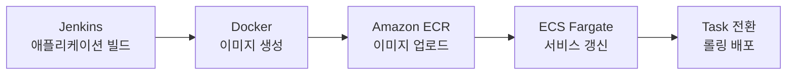

import RoleBoundary from "../../components/content/RoleBoundary.astro";
import CaseSection from "../../components/content/CaseSection.astro";

> 내부 코드와 회원·결제 데이터는 포함하지 않았으며, 사용자가 확인한 서비스와 연결 관계만으로 당시 구조를 재구성했습니다.

## 경력 정보와 역할 경계

젤로텍 v2는 백엔드 2명과 프론트엔드 2명으로 구성된 4인 개발팀이 진행했습니다. 개발 리드로서 백엔드와 인프라를 담당했으며, 프론트엔드 화면 구현은 프론트엔드 개발자 2명이 담당했습니다.

<RoleBoundary
  mine={[
    "4인 개발팀 리드",
    "신규 도메인과 데이터 모델 설계",
    "어드민·키오스크 API 개발",
    "기존 회원 인증 연동",
    "JWT·Spring Security 기반 인증·권한 처리",
    "멀티모듈 공통 코드 구성",
    "AWS VPC와 애플리케이션 실행 환경 구성",
    "프론트엔드 S3 배포와 CloudFront 제공 환경 구성",
    "Jenkins·Docker·ECR·ECS 백엔드 배포 흐름 구성",
  ]}
  team={[
    "백엔드 개발자 1명과 API 개발 협업",
    "프론트엔드 개발자 2명이 사용자 화면 구현",
  ]}
  external={[
    "기존 인증 서비스가 회원 인증 결과와 식별 정보를 제공",
    "S3와 CloudFront가 프론트엔드 파일의 저장과 제공을 담당",
    "ALB가 백엔드 요청 진입점 역할을 수행",
    "ECS Fargate가 Spring Boot 컨테이너를 실행",
  ]}
/>

프로젝트는 주요 백엔드 기능과 배포 환경을 구현한 뒤 전체 제품 완성도와 개발 일정을 포함한 사업 판단으로 출시 전에 종료됐습니다. 아래 내용은 운영 성과가 아니라 출시 전까지 직접 설계·구현한 범위를 설명합니다.

<CaseSection
  id="jellotec-v2"
  title="Case 1. 젤로텍 v2 신규 시스템"
  summary="레거시 payment 중심 구조를 복제하지 않고 신규 시스템 내부의 도메인과 데이터 책임을 다시 나눴습니다."
  featured={true}
>

### 기존 데이터 구조의 문제

기존 `payment` 테이블에는 주문뿐 아니라 상품, 이용권, 프로모션, 회원과 수업 관련 정보가 30개 이상의 컬럼으로 함께 관리되고 있었습니다. 변경 이유와 생명주기가 다른 데이터가 한 구조에 결합돼 있어, 신규 기능을 기존 테이블에 계속 추가하기보다 신규 시스템에서 책임을 다시 나눌 필요가 있었습니다.

```text
기존 payment 중심 구조
├── 주문
├── 상품
├── 이용권
├── 프로모션
├── 회원
└── 수업
```

이 설명은 기존 구조 전체의 품질을 평가하거나 기존 개발자의 판단을 비판하기 위한 것이 아닙니다. 신규 기능을 구현할 때 직접 확인한 결합 범위와 선택한 변경 경계를 설명합니다.

### 별도 신규 시스템 선택

상황:
: 기존 `payment` 구조에 신규 기능을 계속 추가하면 서로 다른 도메인의 변경 범위를 분리하기 어려웠습니다.

검토한 선택지:
: 기존 PHP 시스템을 직접 확장하는 방법과 별도 Spring 시스템을 개발하는 방법을 검토했습니다. 전자는 기존 데이터 구조와 서비스에 변경이 누적되고, 후자는 기존 시스템과의 연동이 필요하지만 신규 모델을 다시 정의할 수 있었습니다.

선택:
: 기존 구조를 그대로 복제하지 않고 별도 Spring 시스템을 개발했습니다.

선택 이유:
: 신규 기능에 필요한 도메인 책임과 관계를 기존 `payment` 테이블에서 분리하고, 기존 서비스에 직접 가하는 변경 범위를 제한하기 위해서였습니다.

감수한 점:
: 개발 기간 동안 기존 PHP 서비스와 신규 Spring 서비스가 공존했고, 기존 회원 인증 서비스와의 연동이 필요했습니다.

### 신규 시스템 내부의 책임 분리



이는 독립 배포되는 마이크로서비스 구성이 아니라 하나의 신규 시스템 내부에서 데이터와 기능의 책임을 나눈 구조입니다. 기존 데이터를 신규 시스템으로 마이그레이션하거나 운영 트래픽을 전환했다는 의미도 아닙니다.

### 기존 회원 인증 연동

기존 회원 계정을 신규 시스템에 중복 생성하는 대신 기존 인증 서비스의 결과와 회원 식별 정보를 사용했습니다. 신규 시스템 내부에서는 JWT와 Spring Security로 인증 사용자를 식별하고 어드민 메뉴별 접근 권한을 적용했습니다.

구체적인 인증 프로토콜, 토큰 공유·갱신 방식과 암호화 알고리즘은 현재 확인할 수 없어 설명 범위에 포함하지 않습니다.

### API와 공통 코드

- 회원·상품 관리와 메뉴별 접근 권한을 위한 어드민 API를 개발했습니다.
- 신규 주문 구조를 사용하는 키오스크 결제 API를 개발했습니다.
- 인증, 예외 처리와 공통 응답 등 반복되는 코드를 멀티모듈 공통 영역으로 분리했습니다.

어드민과 키오스크 API는 출시 전까지 구현한 범위이며, 실제 사용자 트래픽의 처리량이나 운영 안정성을 검증한 결과는 아닙니다.

### 구현 결과와 한계

- 기존 `payment` 중심 구조를 신규 시스템에 그대로 복제하지 않았습니다.
- 상품·이용권·프로모션·회원·수업·주문의 책임을 구분했습니다.
- 기존 PHP 서비스와 신규 Spring 서비스의 경계를 두고 기존 회원 인증을 연동했습니다.
- 어드민과 키오스크 API를 신규 구조에 맞춰 개발했습니다.

프로젝트가 출시 전에 종료돼 실제 데이터 마이그레이션, 운영 트래픽 전환과 사용자 환경 검증은 수행하지 못했습니다.

</CaseSection>

<CaseSection
  id="aws-runtime-deployment"
  title="Case 2. AWS 실행 및 배포 환경"
  summary="확인된 AWS 서비스와 연결 관계만으로 프론트엔드 제공, 백엔드 실행과 배포 경로를 구성했습니다."
  featured={true}
>

### 프론트엔드와 백엔드 실행 경로



프론트엔드 빌드 결과물은 S3에 배포하고 CloudFront를 통해 제공했습니다. Jenkins가 프론트엔드 배포까지 자동화했는지는 확인되지 않아 백엔드 배포 흐름과 분리해 기록합니다.

Spring Boot 애플리케이션은 Private Subnet의 ECS Fargate Task에서 실행했습니다. 외부 요청은 Route 53에 연결된 ALB를 거쳐 애플리케이션으로 전달했고, Task의 외부 통신은 Public Subnet의 NAT Gateway와 Internet Gateway를 경유하도록 구성했습니다.

애플리케이션 데이터베이스로 Amazon RDS를 사용했습니다. RDS의 세부 Subnet과 Multi-AZ 구성은 현재 확인할 수 없어 다이어그램에서 배치를 특정하지 않았습니다. 실제 Availability Zone과 Subnet 수, NAT Gateway 수, ALB의 구체적인 Subnet 배치도 표시하지 않았습니다.

### 백엔드 배포 흐름



Jenkins에서 Spring Boot 애플리케이션을 빌드하고 Docker 이미지를 생성한 뒤 ECR에 업로드했습니다. ECS Fargate 서비스가 새 이미지를 사용하도록 갱신하고, ECS의 롤링 배포와 롤백 기능을 사용하도록 구성했습니다.

이는 ECS가 제공하는 배포 기능을 구성한 범위를 의미합니다. 실제 운영 트래픽에서 무중단 배포, 장애 복구, 배포 시간 단축이나 고가용성을 검증했다는 의미는 아닙니다.

### 확인된 범위와 남은 정보

- 확인됨: VPC, Route 53, ALB, Private Subnet의 ECS Fargate Task, Public Subnet의 NAT Gateway, Internet Gateway, RDS, ECR, S3와 CloudFront 사용
- 확인됨: Jenkins에서 Docker 이미지 빌드, ECR 업로드와 ECS 배포까지의 백엔드 흐름
- 확인되지 않음: Availability Zone과 Subnet 수, NAT Gateway 수, ALB·RDS의 세부 배치, RDS Multi-AZ, Auto Scaling과 Security Group 규칙
- 확인되지 않음: S3 공개 설정, CloudFront OAI·OAC와 캐시 정책, HTTPS·ACM, 프론트엔드 배포 자동화

</CaseSection>

## 근거

- 사용자가 확인한 4인 팀 구성과 역할 범위
- 레거시 `payment` 테이블과 신규 도메인 분리 범위
- 기존 PHP 서비스와 신규 Spring 서비스의 공존 및 인증 연동
- 사용자가 확인한 AWS 서비스와 연결 관계
- 출시 전 종료 사실과 운영에서 검증하지 못한 범위
