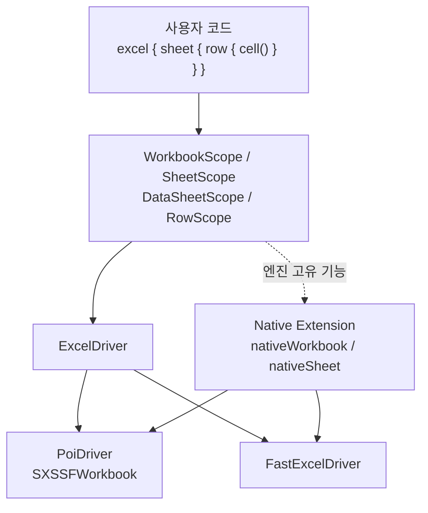

> 실무에서 경험한 엑셀 생성의 성능·복잡도 문제를 특정 보고서에 한정하지 않고, 엔진을 교체할 수 있는 Kotlin 라이브러리로 일반화했습니다.

## 1. 문제의 출발점

엑셀 보고서를 생성하는 코드는 데이터 변환보다 라이브러리 사용 절차가 더 많은 비중을 차지하기 쉽습니다.

```text
Workbook 생성
→ Sheet 생성
→ Row와 Cell 좌표 계산
→ Style 객체 생성·적용
→ 파일 쓰기와 리소스 종료
```

Apache POI와 FastExcel은 같은 XLSX 파일을 생성하지만 API와 지원 기능이 다릅니다. 성능을 이유로 엔진을 바꾸면 보고서 생성 코드도 함께 다시 작성해야 했습니다.

이 프로젝트에서는 다음 문제를 분리해 해결하고자 했습니다.

1. 저수준 엑셀 API가 비즈니스 로직을 가리는 문제
2. 엔진 교체 시 사용자 코드가 함께 변경되는 문제
3. 스트리밍 방식의 제약이 호출자에게 늦게 드러나는 문제
4. 추상화 계층이 네이티브 엔진보다 얼마나 느린지 알 수 없는 문제

---

## 2. 설계 목표

### 목표

- 동일한 DSL로 Apache POI와 FastExcel을 선택할 수 있게 한다.
- Workbook–Sheet–Row–Cell 생명주기와 좌표 계산을 내부에서 관리한다.
- 대용량 데이터는 행 단위로 순차 처리한다.
- 잘못된 스트리밍 접근과 동시 쓰기는 데이터 손상 전에 실패시킨다.
- 추상화 비용을 벤치마크로 측정한다.
- 공통 추상화에 없는 기능은 네이티브 확장 지점으로 제공한다.

### 비목표

- POI와 FastExcel의 모든 기능을 동일하게 추상화하지 않는다.
- 하나의 시트를 여러 스레드에서 동시에 작성하도록 지원하지 않는다.
- 기존 XLSX 파일 수정이나 모든 고급 Excel 기능을 공통 API로 제공하지 않는다.
- 특정 벤치마크 결과를 모든 JVM과 운영 환경의 성능으로 일반화하지 않는다.

---

## 3. 아키텍처



### 사용자 DSL

```kotlin
File("report.xlsx").outputStream().use { output ->
    excel(output) {
        sheet("Summary") {
            row {
                cell(value = "Name")
                cell(value = "Amount")
            }
            row {
                cell(value = "Alice")
                cell(value = 120_000)
            }
        }
    }
}
```

호출자는 Workbook과 Sheet를 직접 닫거나 다음 셀의 좌표를 계산하지 않습니다. Scope가 현재 위치와 리소스 생명주기를 관리합니다.

### ExcelDriver

`ExcelDriver`는 공통 DSL과 실제 엔진 사이의 경계입니다.

```text
ExcelDriver
- startWorkbook
- startSheet
- startRow
- writeCell
- mergeCells
- nativeWorkbook
- nativeSheet
```

`PoiDriver`와 `FastExcelDriver`가 같은 인터페이스를 구현하므로, 사용자 코드는 엔진의 저수준 API에 직접 의존하지 않습니다.

### 엔진 선택

라이브러리는 classpath에서 사용 가능한 엔진을 감지할 수 있으며, 호출자가 명시적으로 Driver를 지정할 수도 있습니다.

```kotlin
excel(output, driver = PoiDriver()) {
    // 동일한 DSL
}
```

라이브러리는 엔진 의존성을 `compileOnly`로 두고, 실제 애플리케이션이 필요한 엔진을 선택하도록 했습니다.

---

## 4. DSL 계층과 스타일 상속

DSL은 Workbook–Sheet–Row–Cell 계층을 그대로 표현합니다.

```text
Workbook default style
        ↓
Sheet default style
        ↓
Row style
        ↓
Cell style
```

하위 단계에서 지정한 속성이 상위 기본값을 덮어씁니다. 스타일 객체 생성과 적용 순서를 호출자가 직접 관리하지 않아도 되도록 했습니다.

컬렉션 기반 데이터는 `dataSheet`로 열 정의와 값을 분리할 수 있습니다.

```kotlin
dataSheet("Inventory", products) {
    column("ID") { it.id }
    column("Name") { it.name }
    column("Price") { it.price }
}
```

이 API의 목적은 엑셀 API 호출보다 출력할 데이터와 열 정의가 코드에서 먼저 보이게 하는 것입니다.

---

## 5. 실용적인 추상화

POI와 FastExcel은 지원 기능이 다릅니다.

- POI: 수식 평가, 차트, 피벗 테이블 등
- FastExcel: 경량 의존성과 빠른 스트리밍 쓰기
- 공통화하기 어려운 기능: 틀 고정, 자동 필터 등 엔진 고유 API

모든 기능을 `ExcelDriver`에 넣으면 인터페이스가 특정 엔진의 기능 집합에 끌려가게 됩니다. 따라서 공통 기능은 DSL로 제공하고, 필요한 경우 `nativeSheet`와 `nativeWorkbook`을 통해 엔진 API에 접근하도록 했습니다.

```kotlin
nativeSheet<SXSSFSheet> { sheet ->
    sheet.createFreezePane(0, 1)
}
```

이 선택으로 공통 사용 경험은 유지할 수 있지만, Native Extension을 사용한 코드는 해당 엔진에 의존하게 됩니다.

---

## 6. Streaming-First와 Fail-Fast

### 행 단위 스트리밍

`Sequence<T>`를 입력받아 데이터를 한 행씩 작성합니다.

```kotlin
rows(largeData) { item ->
    cell(item.id)
    cell(item.name)
}
```

대용량 파일 생성에서는 이미 처리한 행을 메모리에 계속 유지하지 않습니다. 이 때문에 flush가 끝난 이전 행으로 돌아가 수정하는 동작은 지원할 수 없습니다.

### 역방향 행 접근 차단

```text
row 1 작성 → flush
row 2 작성 → flush
row 1 재접근
        ↓
즉시 예외
```

호출자가 파일 생성이 끝난 뒤 깨진 결과물을 확인하는 대신, 허용되지 않는 접근 시점에 오류를 확인하도록 했습니다.

### 동일 시트 동시 쓰기

이 라이브러리는 하나의 시트를 여러 스레드가 동시에 안전하게 작성하도록 만드는 것이 목적이 아닙니다.

두 실행 흐름이 현재 행과 열 상태를 동시에 변경하면 결과 위치를 보장할 수 없습니다. 따라서 쓰기 작업이 진행 중일 때 다른 쓰기가 들어오면 대기시키지 않고 즉시 실패시킵니다.

안전한 설명은 다음과 같습니다.

> 멀티스레드 쓰기를 지원하는 것이 아니라, 동일 시트의 잘못된 동시 사용을 감지해 데이터 손상 전에 실패시킨다.

---

## 7. 벤치마크 설계

### 측정 환경

| 항목 | 환경 |
|---|---|
| JVM | OpenJDK 21 (Adoptium) |
| Heap | 512MB |
| GC | G1GC |
| JMH | 1.36 |
| FastExcel | 0.18.4 |
| Apache POI | 5.2.5 (SXSSF) |

저장소의 현재 라이브러리 버전과 벤치마크 당시 버전은 다를 수 있습니다.

### 확인하려던 질문

1. 네이티브 엔진 API 대비 DSL이 추가하는 비용은 얼마인가?
2. 행 수가 증가했을 때 두 Driver는 제한된 heap에서 완료되는가?
3. 스타일 상속 방식은 개별 셀 스타일보다 어느 정도 비용을 가지는가?
4. 병합 영역이 늘어날 때 POI의 처리량이 왜 급격히 감소하는가?

---

## 8. DSL 핫패스 최적화

### 초기 현상

셀 쓰기는 대용량 파일에서 수십만 번 이상 반복됩니다. 초기 구현에는 안전 검증을 위한 람다와 `runCatching`이 핫루프에 포함됐고, 작은 할당이 반복 실행마다 누적됐습니다.

### 변경

- 반복 경로에 `inline` 적용
- 핫루프의 `runCatching` 제거
- 반복 람다 생성 축소
- 락 획득과 해제를 직접 제어

### 결과

| 지표 | 변경 전 | 변경 후 |
|---|---:|---:|
| FastExcel DSL 오버헤드 | 16.3% | 3.1% |
| DSL 실행당 추가 할당량 | 약 200KB | 약 364B |

`99.8% 감소`는 전체 JVM 메모리 사용량이 아니라 **DSL 실행 과정에서 추가로 발생한 할당량**에 대한 수치입니다.

---

## 9. 대용량 행 생성

| 행 수 | FastExcel Driver | POI SXSSF Driver |
|---:|---:|---:|
| 100,000 | 0.238초 | 0.440초 |
| 1,000,000 | 3.396초 | 4.249초 |

두 Driver 모두 512MB heap의 해당 벤치마크에서 100만 행 생성을 완료했습니다. 이 결과는 측정 환경의 처리 특성을 보여주며, 모든 서버 환경의 절대 성능을 보장하지 않습니다.

---

## 10. POI 병합 성능 분석

### 현상

병합 영역이 증가할수록 POI의 처리량이 급격히 감소하고 GC 할당 속도가 증가했습니다.

### 원인 가설과 확인

POI의 표준 `addMergedRegion`은 새로운 병합 영역을 추가할 때 기존 영역과 겹치는지 검사합니다. 병합 개수가 증가하면 이 검사가 반복되며 비용이 커집니다.

벤치마크에서는 이 동작이 병합이 많은 시나리오의 주요 병목으로 나타났습니다.

### 변경

`PoiDriver`에서 `addMergedRegionUnsafe()`를 사용해 중복 영역 검사를 우회했습니다.

### 결과

| 지표 | 변경 전 | 변경 후 |
|---|---:|---:|
| 병합 처리량 | 3.36 ops/s | 17.42 ops/s |
| GC 할당 속도 | 1580.8 MB/s | 328.6 MB/s |

### 트레이드오프

`Unsafe` API는 중복 병합 검증을 생략합니다. 따라서 Driver 또는 호출 계층이 잘못된 병합 영역을 만들지 않는다는 전제가 필요합니다.

또한 CPU 검증 비용을 줄여도 병합 메타데이터 자체는 파일 작성 완료 시점까지 메모리에 남습니다. 수십만 개의 병합 영역을 사용하는 경우 JVM heap의 영향을 계속 받습니다.

---

## 11. 결과

### 구조적 결과

- 사용자 DSL과 엑셀 엔진 구현을 `ExcelDriver`로 분리했습니다.
- Workbook–Sheet–Row–Cell 생명주기와 좌표 계산을 Scope 내부로 캡슐화했습니다.
- 스트리밍 제약과 동일 시트 동시 쓰기 오용을 Fail-Fast로 드러냈습니다.
- 공통 추상화 밖의 기능은 Native Extension으로 제공했습니다.

### 측정 결과

- FastExcel DSL 오버헤드: 16.3% → 3.1%
- DSL 실행당 추가 할당량: 약 200KB → 약 364B
- POI 병합 처리량: 3.36 → 17.42 ops/s
- 512MB heap에서 최대 100만 행 생성 벤치마크 완료

### 공개 결과

- JitPack `0.1.0` 공개
- MIT License
- README, 사용 예시와 벤치마크 문서 공개

---

## 12. 남은 한계

- POI와 FastExcel의 모든 기능을 같은 의미로 추상화할 수 없습니다.
- Native Extension을 사용한 코드는 특정 엔진에 의존합니다.
- 병합 검증 우회는 잘못된 병합 영역을 별도로 방지해야 합니다.
- 병합 메타데이터의 memory residency는 남아 있습니다.
- 공개 초기 버전으로 외부 사용자의 장기 호환성 검증은 제한적입니다.
- 벤치마크는 특정 JVM·heap·라이브러리 버전에서 수행한 재현 결과입니다.

---

## 13. 배운 점

추상화는 저수준 API를 감추는 것만으로 완성되지 않았습니다.

- 사용자가 해서는 안 되는 동작을 언제 실패시킬 것인지
- 공통 인터페이스에 넣지 않을 기능을 어떻게 탈출구로 제공할지
- 추상화 비용을 어떤 기준으로 측정할지
- 성능을 위해 검증을 우회할 때 어떤 전제가 필요한지

를 함께 정의해야 라이브러리의 책임 범위를 설명할 수 있었습니다.

---

## 14. 근거

- [GitHub 저장소](https://github.com/Hong1008/kexcel)
- [한국어 README](https://github.com/Hong1008/kexcel/blob/main/README.ko.md)
- [성능 벤치마크](https://github.com/Hong1008/kexcel/blob/main/docs/BENCHMARK.ko.md)
- [JitPack v0.1.0](https://jitpack.io/#Hong1008/kexcel/0.1.0)
