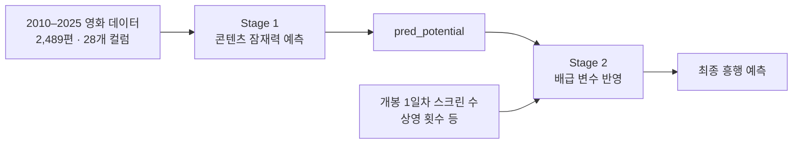

import ExperimentRecord from "../../components/content/ExperimentRecord.astro";
import MetricGrid from "../../components/content/MetricGrid.astro";

## 문제 정의: 스크린 수와 콘텐츠 잠재력

스크린 수는 관객 접근성에 영향을 줄 수 있습니다. 반대로 배급사는 영화의 기대 잠재력을 보고 스크린 수를 결정할 수 있습니다. 단일 모델에 두 요소를 함께 넣으면 콘텐츠 잠재력과 배급 변수의 관계가 한 예측값 안에 섞일 수 있다고 보았습니다.

이 프로젝트의 목표는 인과 효과를 증명하는 것이 아니라, 두 성격의 변수를 분리해 예측에 반영하는 구조를 실험하는 것이었습니다.

## 2-Stage 가설과 데이터

KOBIS와 네이버 데이터랩에서 수집한 2010–2025년 영화 데이터를 MySQL에 적재했습니다. 최종 데이터는 2,489편, 28개 컬럼이며 미래 정보가 학습에 섞이지 않도록 개봉일 기준으로 시간 분할했습니다.

Stage 1은 배급 변수를 제외하고 콘텐츠 잠재력을 예측합니다. 최종 모델은 CatBoost 80%와 XGBoost 20%를 결합한 앙상블로 선정했습니다. Stage 2는 `pred_potential`과 개봉 1일차 스크린 수, 상영 횟수 등 배급 변수를 사용합니다.

## 모델 비교와 제약

개별 후보 모델을 비교한 뒤 Stage 1 앙상블을 최종 구조로 선택했습니다. 후보별 세부 수치가 확인된 범위는 아니므로, 본문에는 최종 앙상블의 평가 결과만 기록합니다.

<ExperimentRecord
  question="배급 변수를 제외한 콘텐츠 잠재력을 어떤 모델로 예측할 것인가?"
  hypothesis="콘텐츠 변수만으로 만든 잠재력 예측값을 다음 단계의 입력으로 사용하면 배급 변수와의 역할을 나눠 볼 수 있다."
  change="CatBoost 80%와 XGBoost 20%를 결합한 Stage 1 앙상블을 사용했다."
  dataset="2010–2025년 영화 2,489편·28개 컬럼, 개봉일 기준 시간 분할"
  metric="R² 0.5638, RMSE 1.3459"
  result="Stage 1 콘텐츠 잠재력 예측의 기준 결과를 기록했다."
  decision="adopted"
  limitation="이 수치는 배급 효과 또는 실제 흥행 의사결정의 품질을 뜻하지 않는다."
/>

Stage 2의 XGBoost에는 스크린 수가 늘어날 때 예상 관객 수가 감소하는 비현실적인 예측 방향을 제한하기 위해 단조 증가 제약을 적용했습니다. 이는 모델의 예측 방향을 제한하는 장치이지, 스크린 수 증가의 실제 인과 효과를 보장하는 장치는 아닙니다.

<ExperimentRecord
  question="배급 변수를 반영한 최종 예측에서 비현실적인 방향을 어떻게 제한할 것인가?"
  change="개봉 1일차 스크린 수에 단조 증가 제약을 적용한 XGBoost를 사용했다."
  dataset="Stage 1 pred_potential과 개봉 1일차 스크린 수·상영 횟수 등 배급 변수"
  metric="R² 0.5517, RMSE 1.3645"
  result="스크린 수 증가에 따라 예상 관객 수가 감소하는 방향을 제한한 Stage 2 결과를 기록했다."
  decision="adopted"
  limitation="관측 데이터의 상관관계를 반영한 예측이며, 배급 변수의 인과 효과를 추론하지 않는다."
/>

## 평가 결과와 해석 범위

<MetricGrid
  label="개봉일 기준 시간 분할 평가 결과"
  metrics={[
    { label: "Stage 1 R²", value: "0.5638", note: "콘텐츠 잠재력 예측" },
    { label: "Stage 1 RMSE", value: "1.3459", note: "콘텐츠 잠재력 예측" },
    { label: "Stage 2 R²", value: "0.5517", note: "배급 변수 반영" },
    { label: "Stage 2 RMSE", value: "1.3645", note: "배급 변수 반영" },
  ]}
/>

두 Stage의 수치는 각 구조에서 기록한 예측 성능이며, Stage 2가 실제 배급 효과를 검증했다는 뜻은 아닙니다. 이 결과를 실제 배급 의사결정 성과나 인과 추론으로 확대하지 않고, 콘텐츠 잠재력과 배급 변수를 나눠 실험한 모델링 사례로 한정합니다.

## 근거

- 사용자가 확인한 역할, 데이터 범위와 모델 구조
- 개봉일 기준 시간 분할의 평가 결과
- Stage 1 앙상블 비중과 Stage 2 단조 증가 제약의 적용 목적
