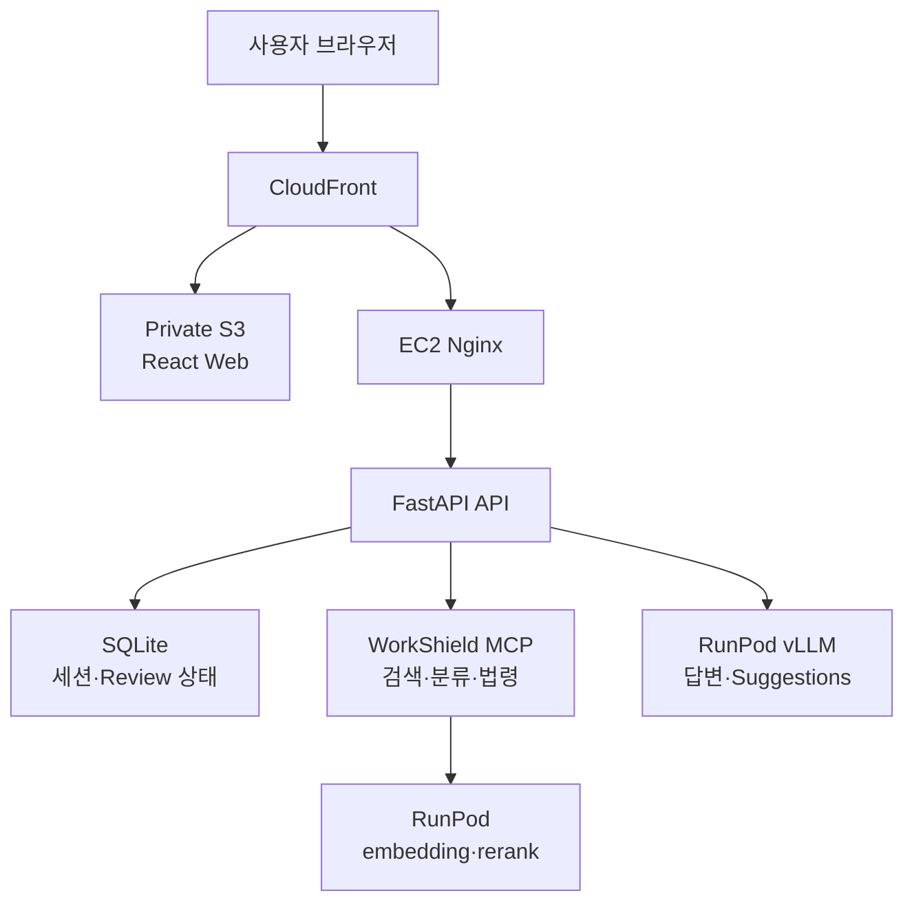
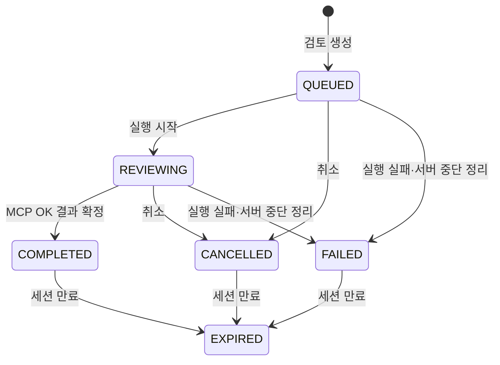

import MetricGrid from "../../components/content/MetricGrid.astro";
import RoleBoundary from "../../components/content/RoleBoundary.astro";

> 법률 판단을 자동화하는 서비스가 아니라, 표준계약서 대비 검토 후보와 근거를 사람이 확인할 수 있도록 기존 MCP를 웹 사용자 흐름에 연결한 프로젝트입니다.

## 1. MCP를 서비스로 연결하며 생긴 문제

선행 프로젝트인 WorkShield MCP는 문서 파싱, 조항 검색·재정렬, 대응 상태 분류와 법령 조회를 결정론적으로 수행합니다. 이번 프로젝트에서는 이 엔진을 사용자가 계약서를 업로드하고 검토 진행 상황과 결과를 확인한 뒤, 근거 범위 안에서 질문할 수 있는 웹 서비스로 연결했습니다.

서비스 계층이 추가되면서 검색 품질과는 다른 문제가 생겼습니다.

- 검토가 진행 중인 상태에서 같은 요청이 반복될 수 있습니다.
- 사용자의 취소와 외부 MCP의 완료 응답이 동시에 도착할 수 있습니다.
- 서버가 중단되거나 SSE 연결이 끊겨도 저장된 상태와 화면의 진행률이 모순되면 안 됩니다.
- LLM이 생성한 문장과 출처 식별자를 그대로 신뢰할 수 없습니다.
- 계약서와 대화처럼 민감할 수 있는 데이터를 만료 시점까지 제한적으로 보관해야 합니다.

따라서 핵심 메시지를 새로운 RAG 엔진 개발이 아니라 **비동기 작업의 상태 일관성**과 **외부 AI 구성 요소의 책임 경계**에 두었습니다.

## 2. 역할과 프로젝트 경계

<RoleBoundary
  mine={[
    "FastAPI API 기반과 MCP Client·LLM provider 추상화",
    "Review 상태 머신, 진행률과 동시 변경 처리",
    "익명 세션·임시 파일 수명주기와 안전한 로그 정책",
    "Chat·Suggestions의 근거 제한과 SSE 스트리밍",
    "AWS CDK 인프라와 GitHub Actions 배포·롤백",
  ]}
  team={[
    "React 웹 애플리케이션과 전체 사용자 흐름",
    "프로젝트 요구사항·데모·문서화 협업",
  ]}
  external={[
    "선행 프로젝트의 WorkShield MCP가 문서 처리·검색·상태 분류 담당",
    "RunPod가 embedding·rerank와 vLLM 모델 실행 담당",
    "CloudFront·S3·EC2·SSM 등 AWS 관리형 기능 사용",
  ]}
/>

3차 프로젝트에서 확인한 RRF 점수 계약 오류와 골든 데이터 F1은 MCP의 결과입니다. Web Platform에서는 이를 새 성과로 중복 계산하지 않고, MCP 결과를 API 상태와 사용자용 응답으로 연결한 범위만 다룹니다.

## 3. 시스템 책임 경계



API 내부에서는 Router가 HTTP 입출력을, Application Service가 사용 사례와 트랜잭션을, Domain이 상태 전이 규칙을 담당하도록 나눴습니다. MCP와 LLM을 호출하는 동안에는 DB 트랜잭션을 열어두지 않고, 외부 응답을 받은 뒤 현재 상태를 다시 확인합니다.

## 4. 비동기 Review 상태와 진행률

검토 상태는 다음과 같이 구분했습니다.



진행 단계는 `PREPARE → BATCH_SEARCH → RERANK → CLAUSE_REVIEW → MISSING_DETECTION → RESULT_ASSEMBLY` 순서를 가집니다. 오래된 이벤트가 뒤늦게 도착해도 화면이 되돌아가지 않도록 다음 규칙을 적용했습니다.

- 단계는 이전 단계로 돌아가지 않습니다.
- 같은 단계의 current와 percent는 감소하지 않습니다.
- 완료 전 percent는 최대 99%이고, `COMPLETED`에서만 100%가 됩니다.
- progress마다 sequence를 증가시켜 오래된 이벤트를 구분합니다.
- MCP의 상태가 `OK`일 때만 Review를 `COMPLETED`로 확정합니다.

서버 재시작으로 중단된 active review는 이어서 실행한 것처럼 만들지 않고 `REVIEW_INTERRUPTED`의 재시도 가능한 실패로 정리합니다.

## 5. 중복 요청과 상태 경쟁을 나눈 방어선

하나의 장치로 전체 멱등성을 주장하지 않고 실패 원인에 따라 방어선을 나눴습니다.

| 실패 가능성 | 방어선 | 책임 범위 |
|---|---|---|
| 같은 요청 재전송 | `Idempotency-Key`와 request fingerprint | 같은 요청의 저장된 응답 재생 |
| 한 세션의 검토 중복 생성 | active review partial UNIQUE index | `QUEUED`·`REVIEWING` 동시 존재 차단 |
| 취소와 완료의 동시 상태 변경 | Review version 기반 낙관적 잠금 | 오래된 상태를 기준으로 한 갱신 충돌 감지 |
| 충돌 뒤 재처리 | 현재 상태 재조회와 제한된 재시도 | 이미 확정된 종료 상태를 덮어쓰지 않음 |
| DB commit 뒤 파일 삭제 실패 | 반복 가능한 파일 삭제 | DB와 파일시스템 사이의 비원자적 경계 처리 |

이 구조는 단일 SQLite·단일 worker 환경의 경쟁 조건을 다루며, 분산 큐나 다중 API 인스턴스의 Exactly-once 실행을 보장하지 않습니다.

## 6. 익명 세션과 임시 파일 수명주기

로그인 기능 없이 업로드 파일의 소유권을 확인하기 위해 익명 세션을 사용했습니다.

- 접근 토큰 원문은 HttpOnly Cookie로 전달하고 DB에는 SHA-256 해시만 저장합니다.
- 세션은 `session_id + token hash`, Review는 상위 세션의 token hash까지 확인합니다.
- 존재하지 않는 리소스와 소유하지 않은 리소스는 같은 404로 응답합니다.
- 사용자 파일명 대신 서버가 생성한 `storage_key`를 저장하고 경로 순회와 절대 경로를 차단합니다.
- 임시 파일은 작성 후 atomic replace하며 삭제는 파일이 없어도 성공하는 반복 가능한 연산으로 처리합니다.
- 세션은 생성 또는 검토 완료 후 30분간 유지하고, 만료 시 파일과 민감한 결과 스냅샷을 제거합니다.

로그에는 request ID, 세션 ID 해시, review ID, 상태와 처리 시간만 남길 수 있습니다. 계약서·조항·프롬프트·검토 결과·대화 본문과 Cookie·API key는 기록하지 않습니다.

## 7. MCP 연결과 실패 경계

로컬과 배포 환경은 MCP에 문서를 전달할 수 있는 조건이 다릅니다.

| 실행 환경 | 연결 | 문서 전달 |
|---|---|---|
| 로컬 | FastAPI lifespan이 `stdio` 자식 프로세스 실행 | 검증된 `file_path` |
| 배포 | Docker Compose 내부 `streamable HTTP` | `file_name`과 base64 `file_content` |

요청마다 MCP 프로세스와 연결을 다시 만들지 않고 `ClientSession`을 유지해 재사용했습니다. API 시작 시 capabilities handshake로 필요한 도구 계약을 확인하고, 실패하면 readiness를 통과시키지 않습니다.

timeout, 네트워크 오류, corpus 미준비와 파이프라인 실패는 같은 오류로 숨기지 않고 API 오류 계약에서 구분합니다. 다만 최종 streamable HTTP 전체 E2E와 장애 주입 완료 여부는 별도 실행 기록이 확인되지 않아 성과로 사용하지 않았습니다.

## 8. LLM보다 먼저 근거를 확정하는 Chat

현행 Chat은 LangGraph 그래프가 아니라 애플리케이션 서비스 파이프라인을 사용합니다.

```text
Review·focus 검증
→ 서버가 답할 수 있는 상태·목록·정책 질문 처리
→ 질문 유형과 대상 조항 선택
→ AnswerPlan 확정
→ 필요한 근거만 추가
→ token 예산에 따라 분할 생성
→ 본문과 출처·제한 metadata 분리 반환
```

LLM을 호출하기 전에 `AnswerPlan`에서 질문 유형, 대상 조항과 사용할 근거를 확정합니다. 이전 답변 원문 전체를 장기 문맥으로 저장하지 않고, 검증된 `conversation_token`에 직전 질문 유형·대상 ID·다음 offset과 같은 의미 상태만 임시 저장합니다.

긴 결과는 최대 3개 항목씩 순차 생성하며 SSE의 `progress`, `delta`, `segment_complete`, `completed`, `failed` 이벤트로 전달합니다. 중간 묶음이 실패하면 이미 전달한 답변과 출처를 보존하고 continuation offset으로 남은 항목을 이어서 요청할 수 있습니다.

## 9. LLM 출처를 백엔드 책임으로 변경

초기에는 LLM이 실제 사용자 조항 ID와 표준조항 ID를 문자열로 생성했습니다. 작은 모델이 설명을 생성하고도 ID 복사에 실패해 전체 결과가 차단되는 문제가 있어 책임을 바꿨습니다.

LLM은 `SRC_USER`, `SRC_STANDARD`, `SRC_GROUNDING` 중 근거 종류만 선택합니다. 백엔드는 현재 세션과 요청에서 확인한 실제 ID를 선택된 종류에 결합합니다. 구조화 출력 뒤에는 다음 항목을 결정론적으로 검사합니다.

- 내부 ID와 허용되지 않은 source key
- 입력 근거에 없는 금액·기간·비율
- 합법·위법과 같은 법률 결론 단정
- 중국어·러시아어 문자 혼입
- JSON Schema와 Pydantic 구조 위반

이 검사는 출처 종류 선택 자체의 의미가 정확하거나 환각이 사라졌음을 보장하지 않습니다. 모델이 생성해야 할 식별자와 백엔드가 보장할 수 있는 참조 무결성을 분리한 것입니다.

## 10. 후보 모델 검증

동일한 합성 fixture 8개를 각 모델에 2회씩 실행했습니다. JSON Schema, temperature 0, seed 42와 concurrency 1을 공통 조건으로 두고 최종 gate 통과 여부, latency, token, finish reason과 repair 여부를 artifact로 남겼습니다.

<MetricGrid
  label="Qwen3.5 9B 고정 fixture 개발 검증"
  metrics={[
    { label: "최종 PASS", value: "16 / 16", note: "합성 fixture 8개 × 2회" },
    { label: "Latency p50", value: "7.102초" },
    { label: "Latency p95", value: "16.416초" },
    { label: "언어 repair", value: "2건", note: "최초 출력의 중국어 혼입" },
  ]}
/>

이 결과를 기준으로 `RedHatAI/Qwen3.5-9B-FP8-dynamic`을 답변·Suggestions 후보로 선정했습니다. 16/16은 repair를 포함한 최종 결과이며, 법률 전문가 평가나 실제 계약서 품질, 통계적인 실패율 0%를 뜻하지 않습니다.

## 11. 배포와 권한 경계

정적 Web은 Private S3와 CloudFront OAC로 제공하고, API와 MCP는 단일 EC2에서 Nginx와 Docker Compose로 실행하도록 구성했습니다. 사용자 임시 데이터는 암호화된 EBS에 저장하고 운영 접속은 SSM Session Manager를 사용합니다.

GitHub Actions의 배포 권한과 고권한 인프라 수명주기를 분리했습니다.

- CI에서 API·MCP 테스트, Web typecheck·테스트·빌드, container build, Compose config와 CDK synth를 확인합니다.
- 배포 job은 GitHub OIDC의 단기 AWS credential을 사용합니다.
- 배포 역할은 고정 SSM Document 실행, S3 artifact 게시와 CloudFront invalidation 범위만 가집니다.
- CloudFormation·EC2·IAM 변경, Secrets Manager 값 읽기와 RunPod 관리는 배포 역할에서 제외했습니다.
- 롤백은 다시 빌드하지 않고 이미 검증한 container image와 versioned Web artifact를 다시 활성화합니다.

실제 배포 시간이나 비용 절감 수치는 측정하지 않았습니다. 단일 EC2 구조이므로 고가용성이나 무중단 배포로 표현하지 않습니다.

## 12. 검증 범위

| 영역 | 자동 검증 |
|---|---|
| API | Pytest, Ruff, OpenAPI schema 동기화 |
| MCP | Pytest |
| Web | TypeScript typecheck, Vitest·Testing Library, production build |
| Infra | Python helper test, Docker Compose config, AWS CDK synth |
| Container | API·MCP·Embed/Rerank worker image build |

테스트 개수는 변경될 수 있어 성과 수치로 사용하지 않았습니다. 자동 테스트 통과도 법률적 품질, 보안 완전성이나 실제 운영 안정성을 의미하지 않습니다.

## 13. 근거

- [WorkShield Web 공개 저장소](https://github.com/SKNETWORKS-FAMILY-AICAMP/SKN30-4th-2Team)
- 공개 저장소의 API·Domain·Chat·Suggestions 코드와 테스트
- Review, 익명 세션, LLM 출처 결합과 Chat 라우팅 ADR
- AWS CDK, GitHub Actions workflow와 인프라 운영 문서
- 고정 합성 fixture 기반 LLM 비교 artifact
