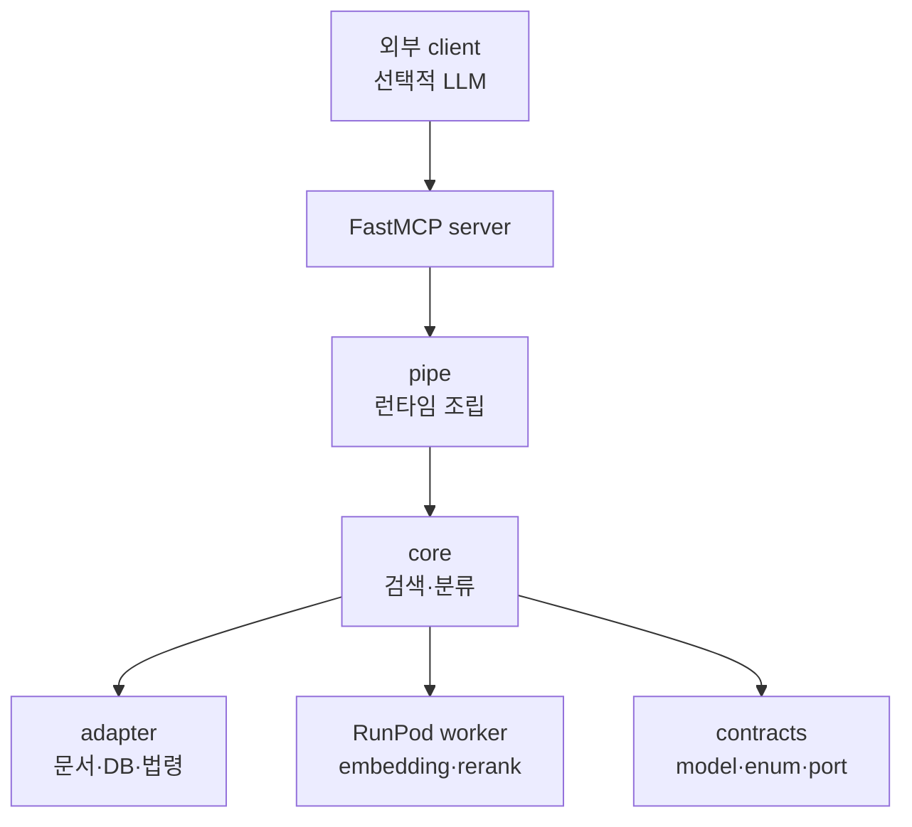
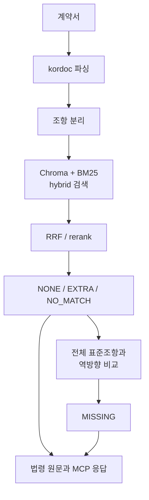

import RoleBoundary from "../../components/content/RoleBoundary.astro";
import ExperimentRecord from "../../components/content/ExperimentRecord.astro";
import MetricGrid from "../../components/content/MetricGrid.astro";

> 법률적 결론을 대신하지 않고, 표준계약서와 비교해 사람이 확인할 조항과 근거의 범위를 좁히는 도구입니다.

## 1. 목표와 비목표

WorkShield는 IT·SW 계약서를 표준계약서와 조항 단위로 비교해 다음 정보를 MCP 도구로 제공합니다.

- 대응하는 표준조항 후보
- 별도 확인이 필요한 조항
- 누락 가능성이 있는 표준조항
- 알려진 주의 문구와의 유사 신호
- 관련 법령 원문

법률 자문, 위법·합법 판단, 계약의 유·불리 확정과 안전성 보장은 범위에 포함하지 않았습니다. 주의 문구 신호가 없다는 사실도 계약이 안전하다는 의미로 해석하지 않습니다.

## 2. 역할과 책임 경계

<RoleBoundary
  mine={[
    "시스템 구조 설계",
    "MCP 서버 구현",
    "RRF 점수 계약 오류 수정",
    "실행 trace 기반 평가 구조 개선",
  ]}
  team={[
    "계약·표준조항 데이터 준비",
    "모델과 평가 실험",
    "데모 작업",
  ]}
  external={[
    "Chroma 벡터 검색",
    "BM25 키워드 검색",
    "RunPod 임베딩·rerank worker",
  ]}
/>

## 3. MCP 서버의 책임 경계

1차 MCP는 LLM 없이 문서 파싱, 조항 분리, 검색, 재정렬, 상태 분류와 법령 원문 연결을 수행합니다. 외부 MCP 클라이언트 또는 데모 계층의 선택적 LLM은 이 결과를 자연어로 설명합니다.

이 경계는 자연어 생성 결과가 검색과 상태 분류 자체를 바꾸지 않도록 분리합니다. 운영 Docker 배포 대상은 MCP 단일 컨테이너이며, 데모 소스는 현재 배포 대상에 포함되지 않습니다.

## 4. 전체 검색 파이프라인

상태는 다음 책임 범위를 가집니다.

| 상태 | 의미 |
|---|---|
| `NONE` | 표준조항과 1차 잠정 매칭 |
| `EXTRA` | 근접 후보는 있지만 임계값 미달 |
| `NO_MATCH` | 검색 후보 자체가 없음 |
| `MISSING` | 사용자 계약서 전체에서 대응되지 않은 표준조항 |

주의 문구 유사 신호는 이 상태와 별도의 축입니다. 알려진 문구와의 유사성을 나타낼 뿐 위법 또는 불공정을 확정하지 않습니다.

## 5. Chroma·BM25·RRF·rerank

Chroma의 벡터 검색과 BM25의 키워드 검색 결과를 결합하고, RRF와 rerank를 거쳐 후속 상태 분류에 전달했습니다. 임베딩과 rerank 실행은 RunPod worker로 분리했습니다.

이 구조에서 확인한 결과는 모델 의존성과 GPU 실행 환경이 MCP 애플리케이션과 분리됐다는 점입니다. 비용 절감, 처리 속도 또는 오토스케일링 효과는 측정하지 않았으므로 성과로 포함하지 않습니다.

## 6. RRF 점수 계약 오류

실제 실행에서 모든 조항이 매칭에 실패했습니다. RRF 결과의 최대 범위는 약 `0.0328`이지만 후속 분류 임계값은 `0.5`였기 때문에 직접 비교하면 어떤 후보도 기준을 넘을 수 없었습니다.

테스트 대역은 실제 RRF 점수 대신 `0.95` 같은 값을 반환했습니다. 자료형은 같은 `float`였지만 값의 생성 방식과 범위, 의미가 달랐기 때문에 모듈 간 계약 오류를 발견하지 못했습니다.

점수 기준과 테스트 대역을 실제 실행 특성에 맞게 수정했습니다. 이 사례에서 인터페이스 계약은 자료형뿐 아니라 값의 범위와 의미까지 포함해야 한다는 점을 확인했습니다.

## 7. 실제 실행 trace 기반 평가

초기 평가 과정은 최종 실행 후 외부 검색을 다시 수행해 후보와 점수를 수집했습니다. 외부 모델을 재호출하면 실제 판정에 사용된 후보와 평가 후보가 달라질 수 있었습니다.

평가 과정에서 검색을 다시 실행하지 않고, 실제 파이프라인이 사용한 후보와 점수를 trace로 보존해 평가 입력으로 사용하도록 변경했습니다.

### 골든 데이터 135건

SI 하도급, SM 하도급, SW 프리랜서 유형별로 45건씩 구성했습니다. 각 유형은 tuning 30건과 held-out 15건으로 나눴으며, 같은 주제 그룹이 두 split에 걸치지 않도록 분리했습니다.

### v5 기준선

<MetricGrid
  label="WorkShield v5 골든 데이터 분류 기준선"
  metrics={[
    { label: "Precision", value: "0.742" },
    { label: "Recall", value: "0.767" },
    { label: "F1", value: "0.754" },
    { label: "Confusion", value: "TP 69 · FP 24 · FN 21 · TN 21" },
  ]}
/>

| 유형 | F1 |
|---|---:|
| SI 하도급 | 0.800 |
| SM 하도급 | 0.781 |
| SW 프리랜서 | 0.653 |

이 지표는 정해진 골든 데이터에서 1차 조항 대응 상태를 분류한 회귀 기준선입니다. 법률적 정확도나 전체 계약의 안전성을 나타내지 않습니다.

## 8. 채택·보류·폐기한 실험

일부 지표가 좋아졌는지만 보지 않고, 사전에 정한 기준과 부작용을 함께 확인했습니다.

<ExperimentRecord
  question="S 실험"
  change="S 실험 설정으로 tuning split을 다시 평가"
  dataset="유형별 tuning 데이터"
  metric="F1"
  result="0.563에서 0.462로 하락"
  decision="rejected"
  limitation="기준선보다 성능이 낮아져 제품 설정에 반영하지 않았습니다."
/>

<ExperimentRecord
  question="C1 실험"
  change="C1 실험 설정으로 SW held-out split을 다시 평가"
  dataset="SW held-out 15건"
  metric="F1, FN, FP"
  result="F1 0.706 → 0.800, FN 4 → 2"
  decision="held"
  limitation="FP가 1건에서 2건으로 늘어 채택하지 않고 보류했습니다."
/>

## 9. 실제 실행 예시

2026년 7월 13일 prod 구성에서 합성 계약서 하나를 실행했습니다.

| 항목 | 건수 |
|---|---:|
| 파싱된 사용자 조항 | 17 |
| `NONE` | 5 |
| `EXTRA` | 12 |
| `NO_MATCH` | 0 |
| `MISSING` | 18 |
| 총 결과 | 35 |
| 주의 문구 신호가 발견된 사용자 조항 | 4 |

이는 하나의 합성 계약서 실행 예시이며 전체 품질 지표나 법률적 결론이 아닙니다.

## 10. 근거

- [GitHub 저장소](https://github.com/SKNETWORKS-FAMILY-AICAMP/SKN30-3rd-2Team)
- 저장소 코드와 테스트
- 2026년 7월 13일 합성 계약서 실행 trace
- 유형별 tuning·held-out 골든 데이터와 v5 평가 결과
